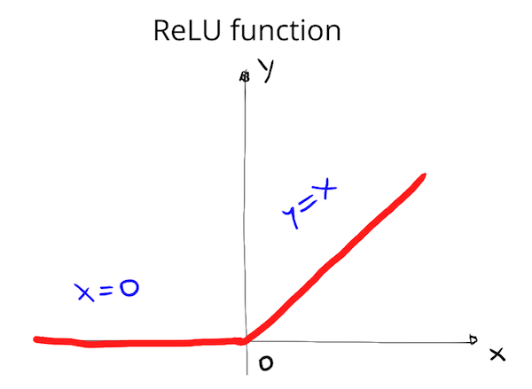
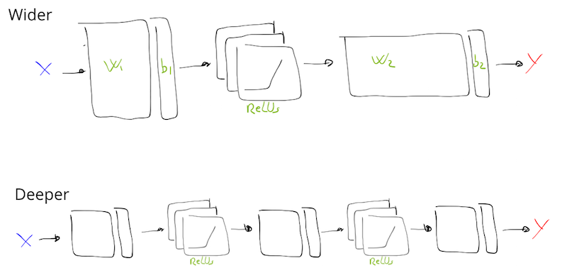

# Lesson 08 - Deep Learning

Deep Learning is used mainly in perception problems.
Deep Learning shines where there is lots of data and complex problems to solve
(i.e. understanding the content of images, translating documents, etc.).

Neural Networks where firstly used in 1980 then they disappeared because of the
limited computing power of PCs.

# TensorFlow

## Tensor

In TensorFlow, values are encapsulated in an object called a tensor.
In the case of `msg = tf.constant('Hello World!')`, `msg` is a 0-dimensional
string tensor, but tensors come in a variety of sizes as shown below:

```python
# X is a 0-dimensional int32 tensor
X = tf.constant(1234)
# Y is a 1-dimensional int32 tensor
Y = tf.constant([ [123,456,789] ])
 # Z is a 2-dimensional int32 tensor
Z = tf.constant([ [123,456,789], [222,333,444] ])
```

The tensor returned by `tf.constant()` is called a constant tensor, because the
value of the tensor never changes.

## Session

TensorFlow works around the idea of **computational graph**, a way of
visualizing a mathematical process.
A TensorFlow's session is an environment for running such graph. The Session
manages all the operations that run on GPU(s) and/or CPU(s).

```python
msg = tf.constant("hello world")

with tf.Session() as s:
    output = s.run(msg)
```

The code creates a session instance, `s`, using `tf.Session`. The `s.run()`
function then evaluates the tensor and returns the results.

## Input

What if you want to use a non tensor?

This is where `tf.placeholder()` and `feed_dict` come into place.

### tf.placeholder()

Sadly you can’t just set x to your dataset and put it in TensorFlow, because
over time you'll want your TensorFlow model to take in different datasets with
different parameters. We need `tf.placeholder()`.

`tf.placeholder()` returns a tensor that gets its value from data passed to
the `tf.session.run()` function, allowing you to set the input right before
the session runs.

### tf.Variable()

The `tf.Variable` class creates a tensor with an initial value that can be
modified, much like a normal Python variable.
This tensor stores its state in the session, so we must initialize the
state of the tensor manually. Use the `tf.initialize_all_variables()`
function to initialize the state of all the Variable tensors.

```python
# Declare a tensor which value can be modified.
x = tf.Variable(5)

# Returns an operation that will initialize all TensorFlow
# variables from the graph.
init = tf.initialize_all_variables()

# Initialize the variables by running the operation.
with tf.Session() as sess:
    sess.run(init)
```

### Session’s feed_dict

```python
x = tf.placeholder(tf.string)

with tf.Session() as s:
    output = s.run(x, feed_dict={x: 'Hello World'})
```

Use the `feed_dict` parameter in `tf.session.run()` to set the placeholder
tensor. The above example shows the tensor `x` being set to the string
`"Hello, world"`. It's also possible to set more than one tensor using
feed_dict as shown below.

```python
x = tf.placeholder(tf.string)
y = tf.placeholder(tf.int32)
z = tf.placeholder(tf.float32)

with tf.Session() as s:
    output = s.run(x, feed_dict={x: 'Test String', y: 123, z: 45.67})
```

### Tensor Random Initialization

```python
import tensorflow as tf

n_features = 120
n_labels = 5
bias = tf.Variable(tf.zeros(n_labels))
weights = tf.Variable(tf.truncated_normal((n_features, n_labels)))

with tf.Session() as sess:
    sess.run(tf.initialize_all_variables())

    print(weights.eval())
    print("weights shape:", weights.get_shape())

    print(bias.eval())
    print("bias shape", bias.get_shape())
```

## TensorFlow Math

We can also perform basic mathematical operations in TensorFlow.
We just need to define some tensors as mathematical operations.
In the snippet below we make use of `tf.div()` and `tf.sub()`.

```python
import tensorflow as tf

# This code does the following
# x = 10
# y = 2
# z = x/y -1
x = tf.constant(10)
y = tf.constant(2)
z = tf.sub(tf.div(x,y),tf.constant(1))

with tf.Session() as sess:
    output = sess.run(z)
    print(output)
```

# Normalizing inputs and initial weights

When computing numerical values with PCs we always need to take care of
the computer precision. If we take a really big number (say 1 billion) and
we add to it a really small number (say 1e-6) a million time, the result may
differ from what we expect.

```python
a = 1000000000
for i in range(1000000):
    a = a + 1e-6

print(a - 1000000000)
```

The code above outputs `0.95367431640625` instead of `1.0`.
We have lost 5% of the value just in numerical computation.
For this reason, it is really important to avoid mathematical operations with
numbers really far away from each other. In the case of computing weights
and bias we want to set those initial values to be nice numbers.

What does being nice mean?

In the field of numerical optimization, we can choose nice values from
Gaussian distributions with **zero-mean** and **equal variance**.
There are also mathematical reasons in choosing values from this kind of
distributions, in particular, the optimization problem has a searching
space that is smaller than in other situations.

When dealing with images the approach consists in taking the RGB pixel values
(typically numbers from 0 to 255) subtract 128 to those values and divide each
of them by 128. This approach guarantees that the values have Normal
distribution with zero-mean and equal variance.

    x_i = (1 / 128) * (x_i - 128)

When it comes to weights and bias we want to choose them from Normal
distribution with zero-mean and small sigma.

## From Linear to Non-Linear models

Linear models are working great but what if we want to train a model that is a
Non-Linear function?

The idea is simple: **take a linear model** and stick into it a hidden layer
with `H` ReLUs (Rectified linear unit) functions.

The ReLUs function is a special type of activation function defined as
`f(x) = max(0, x)`. In other words the ReLU is `0` if x is negative, and `y = x`
otherwise. TensorFlow provides the ReLU function as `tf.nn.relu()`.



```python
import tensorflow as tf

output = None
hidden_layer_weights = [
    [0.1, 0.2, 0.4],
    [0.4, 0.6, 0.6],
    [0.5, 0.9, 0.1],
    [0.8, 0.2, 0.8]]
out_weights = [
    [0.1, 0.6],
    [0.2, 0.1],
    [0.7, 0.9]]

# Weights and biases
weights = [
    tf.Variable(hidden_layer_weights),
    tf.Variable(out_weights)]
biases = [
    tf.Variable(tf.zeros(3)),
    tf.Variable(tf.zeros(2))]

# Input
features = tf.Variable([
    [1.0, 2.0, 3.0, 4.0],
    [-1.0, -2.0, -3.0, -4.0],
    [11.0, 12.0, 13.0, 14.0]
])

# Create Model Y = ReLU(X * W_1 + b_1) * W_2 + b_2
# where ReLU(X * W_1 + b_1) is the hidden layer.
hidden_layer = tf.add(tf.matmul(features, weights[0]), biases[0])
hidden_layer = tf.nn.relu(hidden_layer)
logits = tf.add(tf.matmul(hidden_layer, weights[1]), biases[1])

# Print results
with tf.Session() as sess:
    sess.run(tf.initialize_all_variables())
    print(sess.run(logits))
```

The code above represents a 2-layers Neural Network.

We can go deeper with Neural Networks by increasing the number of hidden layers
by adding more ReLUs blocks.

**Hint:** typically, Neural Networks perform better when they are **deeper** rather
than when they are wide. Wider neural networks requires more computational power
and they do not provide results as good as deeper nets.



## Saving and Restoring models

The `tf.train.Saver` class provides useful method to save and restore `tf.Variable`
objects to the file system.

### Saving Variables

```python
import tensorflow as tf

# The file path to save the data
save_file = 'model.ckpt'

# Two Tensor Variables: weights and bias
weights = tf.Variable(tf.truncated_normal([2, 3]))
bias = tf.Variable(tf.truncated_normal([3]))

# Class used to save and/or restore Tensor Variables
saver = tf.train.Saver()

with tf.Session() as sess:
    # Initialize all the Variables
    sess.run(tf.initialize_all_variables())

    # Show the values of weights and bias
    print('Weights:')
    print(sess.run(weights))
    print('Bias:')
    print(sess.run(bias))

    # Save the model
    saver.save(sess, save_file)
```

The line `saver = tf.train.Saver()` creates an instance of the `Saver` class,
later, the line `saver.save(sess, save_file)` saves the model.

In this particular scenario we just saved two variables but we can save an entire
model.

### Loading Variables

```python
# Remove the previous weights and bias
tf.reset_default_graph()

# Two Variables: weights and bias
weights = tf.Variable(tf.truncated_normal([2, 3]))
bias = tf.Variable(tf.truncated_normal([3]))

# Class used to save and/or restore Tensor Variables
saver = tf.train.Saver()

with tf.Session() as sess:
    # Load the weights and bias
    saver.restore(sess, save_file)

    # Show the values of weights and bias
    print('Weight:')
    print(sess.run(weights))
    print('Bias:')
    print(sess.run(bias))
```

On the other hand, it is very easy to load saved `tf.Variable` objects.
Firstly, clear your graph with `tf.reset_default_graph()`, secondly, create an
instance of the `Saver` object and finally, load the variables from the file
system with `saver.restore(sess, save_file)`.
