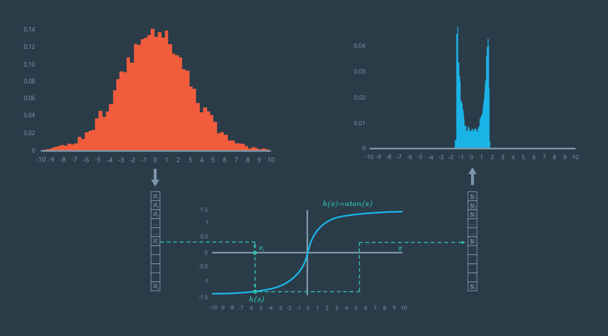

# Kalman Filter

_Kalman filtering, is an algorithm that uses a series of measurements observed
over time, containing statistical noise and other inaccuracies, and produces
estimates of unknown variables that tend to be more precise than those based on
a single measurement alone._ - [Wikipedia](https://en.wikipedia.org/wiki/Kalman_filter)

In Self Driving cars, the Kalman Filter algorithm is exploited to combine raw
data gathered from:

  * Radar sensors
  * Lidar sensors

In particular, through the Kalman Filter algorithm, a Self Driving car is capable
of understanding its surrounding.

Due to the need of real-time computation, Kalman Filters are typically implemented
using a high-performance programming language such as: C++.

## How It Works

The Kalman Filter represents our distributions by guassians and iterates on two
main cycles.

### 1. Measurement Update (Prediction)

Let's say we know an object's current position and velocity , which we keep in
the *x* variable. Now one second has passed. We can predict where the object will
be one second later because we knew the object position and velocity one second
ago; we'll just assume the object kept going at the same velocity.

The equation (11) does these prediction calculations for us.

But maybe the object didn't maintain the exact same velocity. Maybe the object
changed direction, accelerated or decelerated. So when we predict the position
one second later, our uncertainty increases. Equation (12) represents this increase
in uncertainty.

Process noise refers to the uncertainty in the prediction step. We assume the
object travels at a constant velocity, but in reality, the object might accelerate
or decelerate. The notation *ν ∼ N(0,Q)* defines the process noise as a gaussian
distribution with mean zero and covariance Q.

In this phase, two mathematical concepts are taken into account:

  * The product of the measurements
  * The [Bayes Rule](https://en.wikipedia.org/wiki/Bayes%27_rule)

Let assume we have:

  * a **prior probability** which is a Normal Distribution with mean **u1** and
    variance **s1**;
  * a **measurement probability** which is a Normal Distribution with mean **u2**
    and variance **s2**;

We want to compute the **posterior probability** as result of the **measurement
update**. The new Normal Distribution will be a Gaussian with

  * `u = (u1*s2 + u2*s1)/(s1 + s2)`
  * `s = 1 / [(1/s1) + (1/s2)]`

In python this math is coded as follows:

```python

def update(mean1, var1, mean2, var2):
    """ Given the mean and variance of two different Gaussian Distributions,
        it computes the mean and variance of the new Gaussian of the measurement.
    """
    new_mean = (mean1*var2 + mean2*var1) / (var1 + var2)
    new_var = 1 / (1/var1 + 1/var2)
    return [new_mean, new_var]
```

### 2. Motion Update

Now we get some sensor information that tells where the object is relative to the
car. First we compare where we think we are with what the sensor data tells us:
Equation (13).

The *K* matrix, often called the **Kalman filter gain**, combines the uncertainty
of where we think we are *P'* with the uncertainty of our sensor measurement *R*.
If our sensor measurements are very uncertain (*R* is high relative to *P'*),
then the Kalman filter will give more weight to where we think we are: *x'*.
If where we think we are is uncertain (*P'* is high relative to *R*), the Kalman
filter will put more weight on the sensor measurement: *z*.

Measurement noise refers to uncertainty in sensor measurements. The notation
*ω ∼ N(0,R)* defines the measurement noise as a gaussian distribution with mean
zero and covariance *R*. Measurement noise comes from uncertainty in sensor
measurements.

In this phase, two mathematical concepts are taken into account:

  * Convolution
  * The [Total Probability](https://en.wikipedia.org/wiki/Law_of_total_probability)


When it comes to the motion update, the math is really straight forward.
Lets assume we are in position **x** with a Distribution probability with mean
**u1** and variance **s1**. We move in one direction with a Distribution probability
with mean **u_mov** and variance **s_mov** the new motion update will be a Gaussian
with:

  * `u = u1 + u_mov`
  * `s = s1 + s_mov`

  In python this math is coded as follows:

  ```python

  def predict(mean1, var1, mean2, var2):
      """ Given the mean and variance of two different Gaussian Distributions,
          predict your new mean and variance given the mean and variance of your
          prior belief and the mean and variance of your motion.
      """
      new_mean = mean1 + mean2
      new_var = var1 + var2
      return [new_mean, new_var]
  ```

### Put everything together

Let assume we have a set of **measurements** and **motions** and we want to compute
the belief the final position. The following snippet does the magic:

```python

measurements = [5., 6., 7., 9., 10.]
motion = [1., 1., 2., 1., 1.]
measurement_sig = 4.
motion_sig = 2.
mu = 0.
sig = 10000.

#Please print out ONLY the final values of the mean
#and the variance in a list [mu, sig].

# Insert code here
for idx in range(len(measurements)):
    [mu, sig] = update(mu, sig, measurements[idx], measurement_sig)
    #print "update", [mu, sig]
    [mu, sig] = predict(mu, sig, motion[idx], motion_sig)
    #print "motion", [mu, sig]

print [mu, sig]
```

# Multi dimensions Kalman Filter Design

```python

def kalman_filter(x, P):
    for n in range(len(measurements)):

        # measurement update
        Z = matrix([[measurements[n]]])
        y = Z - H * x   # error calculation
        S = H * P * H.transpose() + R
        K = P * H.transpose() * S.inverse() # kalman gain

        # New state
        x = x + K * y
        P = (I - K*H) * P

        # prediction
        x = F * x + u
        P = F * P * F.transpose()

    return x,P

############################################
### use the code below to test your filter!
############################################

measurements = [1, 2, 3]

x = matrix([[0.], [0.]])               # initial state (location and velocity)
P = matrix([[1000., 0.], [0., 1000.]]) # initial uncertainty
u = matrix([[0.], [0.]])               # external motion
F = matrix([[1., 1.], [0, 1.]])        # next state function
H = matrix([[1., 0.]])                 # measurement function
R = matrix([[1.]])                     # measurement uncertainty
I = matrix([[1., 0.], [0., 1.]])       # identity matrix

print kalman_filter(x, P)
```

# Kalman Filter Algorithm Map


The Kalman Filter will receive data from two different sensors:

  * Lidar (cartesian coordinate system)
  * Radar (polar coordinate system)

**First measurement** - the filter will receive initial measurements of the object's
position relative to the car. These measurements will come from a radar or lidar sensor.

**Initialize state and covariance matrices** - the filter will initialize the object's
position based on the first measurement.

Another sensor measurement will come after a time period Δt.

**Predict** - the algorithm will predict where the object will be after time Δt.
One basic way to predict the object location after Δt is to assume the object's
velocity is constant; thus the object will have moved velocity * Δt.

**Update** - the filter compares the "predicted" location with what the sensor
measurement says. The predicted location and the measured location are combined to give
an updated location.

The car will receive another sensor measurement after a time period Δt. The algorithm
then does another predict and update step.

### Question

*What should a Kalman Filter do if both the radar and laser measurements arrive
at the same time, k+t? Hint: The Kalman filter algorithm predicts -> updates ->
predicts -> updates, etc. If two sensor measurements come in simultaneously, the
time step between the first measurement and the second measurement would be zero.*

Predict the state to k+t then use either one of the sensors to update. Then predict
the state to k+t again and update with the other sensor measurement.

# Lidar measurement (position)

  * **z** is the measurement vector. For a lidar sensor, the z vector contains the
    *position−x* and *position−y* measurements.
  * **H** is the matrix that projects your belief about the object's current state
    into the measurement space of the sensor. For lidar, this is a fancy way of
    saying that we discard velocity information from the state variable since the
    lidar sensor only measures position: The state vector x contains information
    about *[p​x, p​y, v​x, v​y]* whereas the z vector will only contain *[px, py]*.
    Multiplying Hx allows us to compare x, our belief, with z, the sensor measurement.
  * What does the prime notation in the x vector represent? The prime notation
    like *p​x'* means you have already done the update step but have not done the
    measurement step yet. In other words, the object was at px. After time Δt,
    you calculate where you believe the object will be based on the motion model
    and get px'.

```c++
// Process a single measurement
void Tracking::ProcessMeasurement(const MeasurementPackage &measurement_pack) {
    if (!is_initialized_) {
        //cout << "Kalman Filter Initialization " << endl;

        //set the state with the initial location and zero velocity
        kf_.x_ << measurement_pack.raw_measurements_[0], measurement_pack.raw_measurements_[1], 0, 0;

        previous_timestamp_ = measurement_pack.timestamp_;
        is_initialized_ = true;
        return;
    }

    // compute the time elapsed between the current and previous measurements
    // dt - expressed in seconds
    float dt = (measurement_pack.timestamp_ - previous_timestamp_) / 1000000.0;
    previous_timestamp_ = measurement_pack.timestamp_;

    //1. Modify the F matrix so that the time is integrated (equation 21)
    kf_.F_(0,2) = dt;
    kf_.F_(1,3) = dt;

    // precompute some constants
    float dt2 = pow(dt, 2);
    float dt4_4 = pow(dt, 4)/4;
    float dt3_2 = pow(dt, 3)/2;

    float q00 = noise_ax * dt4_4;
    float q02 = noise_ax * dt3_2;

    float q11 = noise_ay * dt4_4;
    float q13 = noise_ay * dt3_2;

    float q20 = noise_ax * dt3_2;
    float q22 = noise_ax * dt2;

    float q31 = noise_ay * dt3_2;
    float q33 = noise_ay * dt2;

    //2. Set the process covariance matrix Q (equation 40)
    kf_.Q_ = MatrixXd(4, 4);
    kf_.Q_ << q00, 0, q02, 0,
        0, q11, 0, q13,
        q20, 0, q22, 0,
        0, q31, 0, q33;

    //3. Call the Kalman Filter predict() function
    kf_.Predict();

    //4. Call the Kalman Filter update() function
    // with the most recent raw measurements_
    kf_.Update(measurement_pack.raw_measurements_);

    std::cout << "x_= " << kf_.x_ << std::endl;
    std::cout << "P_= " << kf_.P_ << std::endl;
}
```

# Radar measurement (radial velocity)

  * **z** is the measurement vector. For a radar sensor, the z vector contains the
    *range*, the *bearing* and the *radial velocity* measurements.
    * **range - ρ** is the radial distance from the origin.
    * **bearing - φ** is the angle between ρ and x.
    * **radial velocity - ρ_dot** is the change of ρ.
  * **H** is the matrix that projects your belief about the object's current state
    into the measurement space of the sensor. For radar, this is a non-linear model.
    The state vector x contains information about *[p​x, p​y, v​x, v​y]* whereas the
    z vector will only contain *[range, bearing, radial position]*.
    Multiplying Hx allows us to compare x, our belief, with z, the sensor measurement.
  * Given that the radar model is non-linear, applying a nonlinear function to a
    Gaussian distribution removes its "Gaussian-ness".



However, we can approximate the non-linear model using the *Taylor series expansion*
of the *arctan(x)*. By doing so, the input data maintain its "Gaussian-ness".


In particular, the function *y=arctan(x)* can be approximate to *y=x* when *x->0*.

# Jacobian Matrix

Thanks to the linearization of the *arctan(x)* we can compute the **Jacobian**
matrix that will be used to linearize the radar measurements.

```c++
MatrixXd CalculateJacobian(const VectorXd& x_state) {

	MatrixXd Hj(3,4);
	//recover state parameters
	float px = x_state(0);
	float py = x_state(1);
	float vx = x_state(2);
	float vy = x_state(3);

	//check division by zero
	float px2_py2 = px*px + py*py;
	float sqrt_px2_py2 = sqrt(px2_py2);
	float px2_py2_3_2 = pow(px2_py2, 1.5);

    if (px2_py2 == 0) {
        cout << __func__ << ": Error division by zero.\n";
        return Hj;
    }

    float h_00 = px / sqrt_px2_py2;
    float h_01 = py / sqrt_px2_py2;
    float h_10 = - py / px2_py2;
    float h_11 = px / px2_py2;
    float h_20 = py * (vx*py - vy*px) / px2_py2_3_2;
    float h_21 = px * (vy*px - vx*py) / px2_py2_3_2;
    float h_22 = h_00;
    float h_23 = h_01;

	//compute the Jacobian matrix
	Hj << h_00, h_01, 0.0, 0.0,
	    h_10, h_11, 0.0, 0.0,
	    h_20, h_21, h_22, h_23;

	return Hj;
}
```

# Root Mean Squared Error

```c++
VectorXd CalculateRMSE(const vector<VectorXd> &estimations,
		const vector<VectorXd> &ground_truth){

	VectorXd rmse(4);
	rmse << 0,0,0,0;

	// check the validity of the following inputs:
	//  * the estimation vector size should not be zero
	if (estimations.size() == 0) {
	    cout << "The estimation vector size should not be zero.\n";
	    return rmse;
	}

	//  * the estimation vector size should equal ground truth vector size
	if (estimations.size() != ground_truth.size()) {
	    cout << "The estimation vector size should equal ground truth vector size.\n";
	    return rmse;
	}

	//accumulate squared residuals
	for(int i=0; i < estimations.size(); ++i){
        VectorXd residual = estimations[i] - ground_truth[i];

		//coefficient-wise multiplication
		residual = residual.array() * residual.array();
		rmse += residual;
	}

	//calculate the mean
	rmse = rmse/estimations.size();

	//calculate the squared root
	rmse = rmse.array().sqrt();

	//return the result
	return rmse;
}
```
